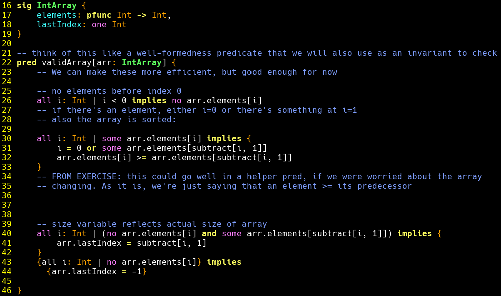

A tree-sitter grammar for the [Forge](https://github.com/tnelson/Forge)
language.

Mainly for syntax-highlighting on NeoVim and Emacs.

Not all syntax are implemented, especially since there are ambiguities in
the Forge syntax, but it's enough for usage.



## Instructions

### NeoVim

1. Register the `forge` language with your NeoVim. In your `init.lua`,
   ```lua
   vim.filetype.add({
     extension = {
       frg = function(path, bufnr)
         return "forge", function(bufnr)
           -- for https://neovim.io/doc/user/various.html#commenting
           vim.api.nvim_set_option_value("commentstring", "// %s", { buf = bufnr })
         end
       end,
     },
   })
   ```

2. Install `nvim-treesitter`.

3. Add a parser according to the [official
   instructions](https://github.com/nvim-treesitter/nvim-treesitter?tab=readme-ov-file#adding-parsers).
   I recommend cloning the repository locally. If you choose this, then the
   snippet for adding Forge would be:
   ```lua
   parser_config.forge = {
     install_info = {
       url = "<path>/tree-sitter-forge", -- path to the cloned tree-sitter-forge
       files = {"src/parser.c"},
     },
   }
   ```

   Note that if `:TSInstall forge` gives you an ABI version mismatch error, try
   `:TSInstallFromGrammar forge`.

   To enable highlighting, my approach is to add a symlink
   `$rtp/queries/forge` -> `<path-to-tree-sitter-forge>/queries`. On Linux, this
   would be `ln -s <path-to-tree-sitter-forge>/queries/
   ~/.config/nvim/queries/forge`. For more info, see [Adding
   queries](https://github.com/nvim-treesitter/nvim-treesitter?tab=readme-ov-file#adding-queries)
   section in the official nvim-treesitter docs.

4. The grammar will probably be updated frequently as the semester goes on. To
   update it, simply `git pull --rebase` in your cloned `tree-sitter-forge` repo
   and then run `:TSUpdate forge`.

### Emacs

IDK, lookup "tree-sitter for Emacs". If you're using Emacs already you should be
able to figure this out by yourself.
